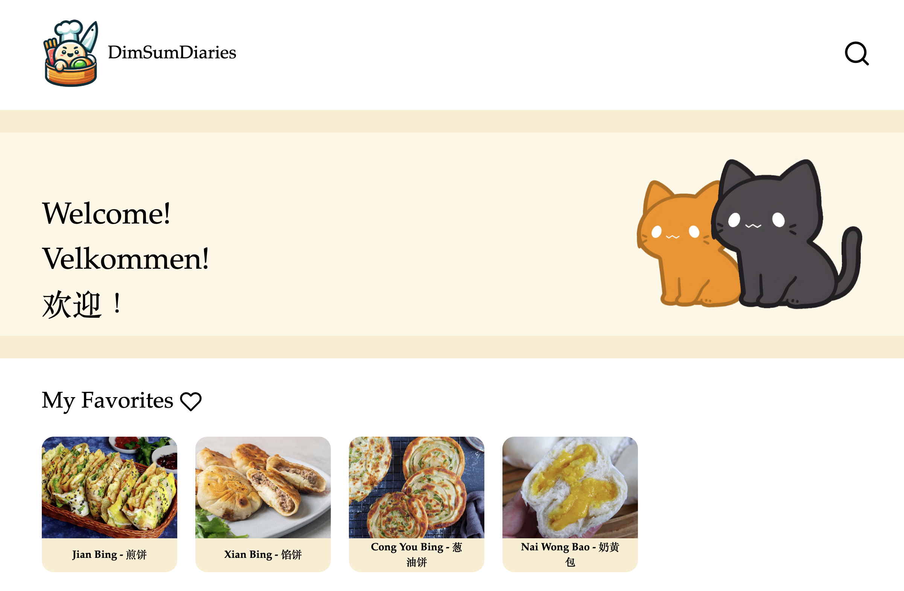
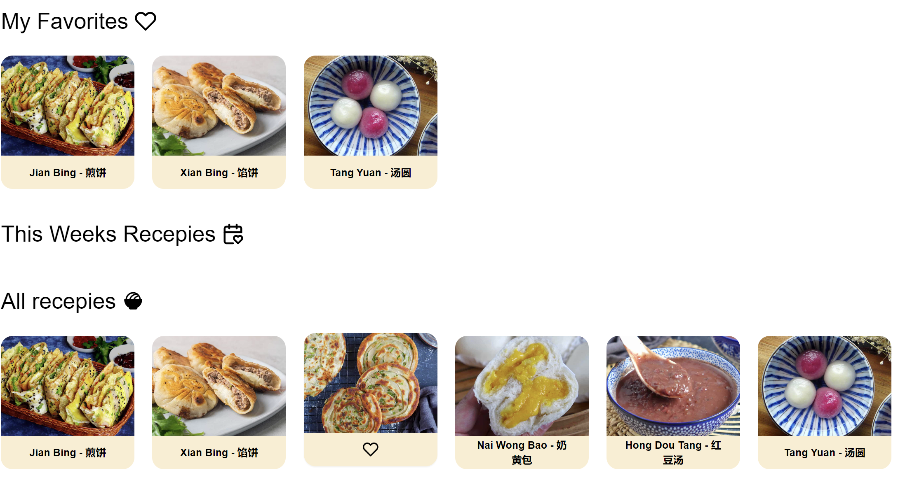
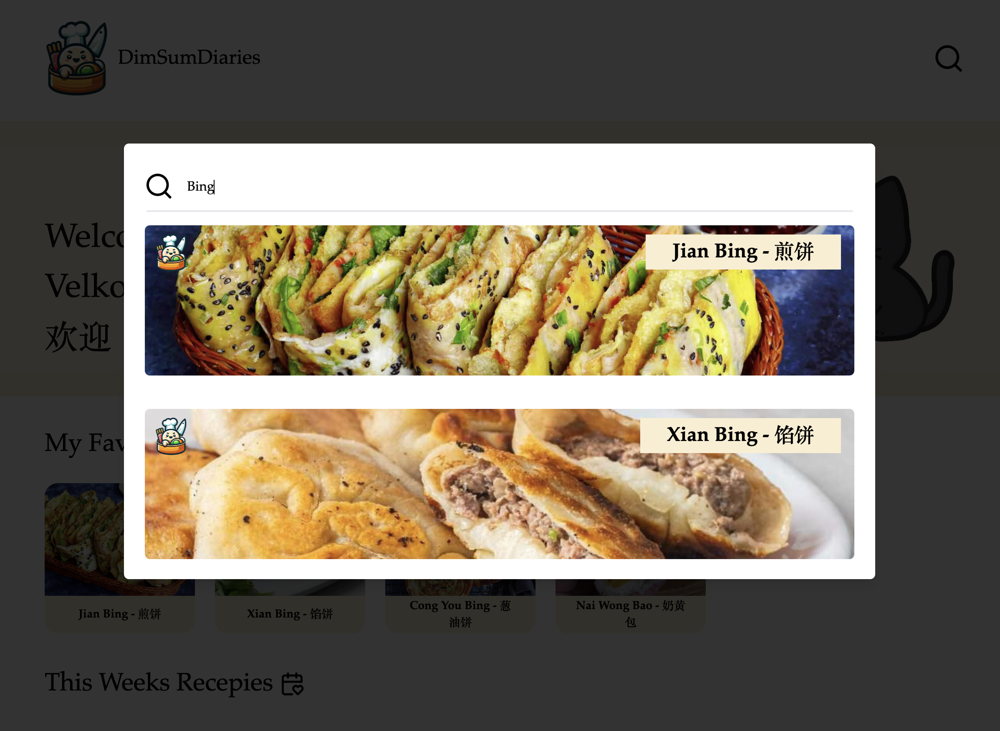
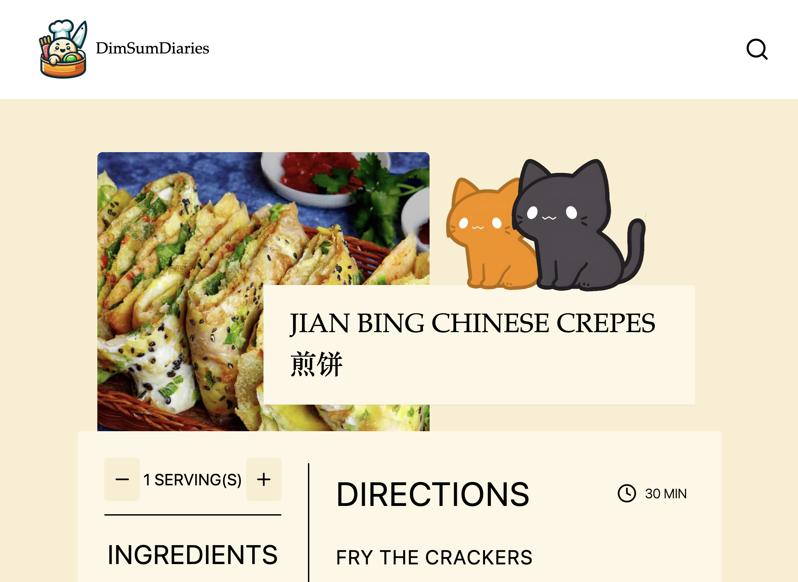

# DimSumDiaries
This is a repository for the DimSumDiaries project that works as an online cookbook with my recipes, and as a hidden "koke" book for my fellow students at NTNU: What't the catch, find out how do get to the "koke" book (ongoing).

<div style="width:70%; margin: auto;">

</div>

## Table of Contents

-   [DimSumDiaries](#dimsumdiaries)
    -   [Table of Contents](#table-of-contents)
    -   [Description](#description)
    -   [Installation \& Setup](#installation--setup)
        -   [Installation](#installation)
        -   [Backend](#backend)
        -   [Frontend](#frontend)

## Description

This application has a favorite fucntion, where one can favorite a recipe by clicking on the heart. The favorited recepies are then saved in their own list.

<div style="width:70%; margin: auto;">

</div>

The application includes a search feature on the current dataset. You can search through different recipes.

<div style="width:70%; margin: auto;">

</div>

When you click on either a recipe on the homepage or when searching you get to the recipe page.

<div style="width:70%; margin: auto;">

</div>

When there are too many recipes on the homepage you can scroll through them!

<div style="width:70%; margin: auto;">

</div>

## Installation & Setup

### Installation

To run the app locally follow instructions bellow (_you need to have [Node.js](https://nodejs.org/en/) v20.5+ installed_)


To get started clone the repository:
```
git clone https://github.com/A1ice-Z/DimSumDiaries.git
```

### Backend

//TODO


### Frontend

Be sure to go into the correct point in the file structure:

```
cd frontend/DimSumDiaries/
```

Install dependencies:

```
npm install
```

Run the app:

```
npm run dev
```

Then click on the link given and play around with the app 